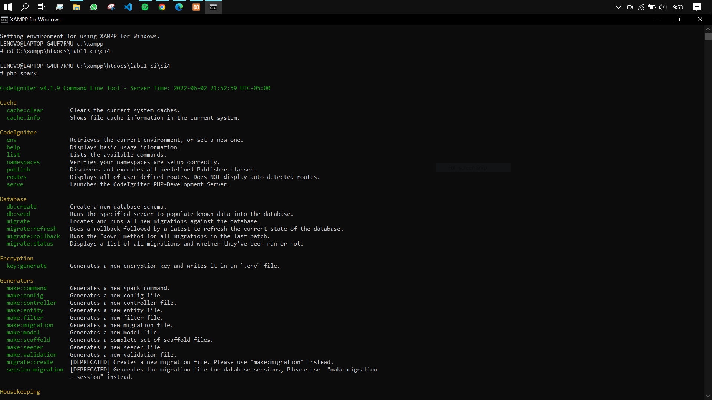
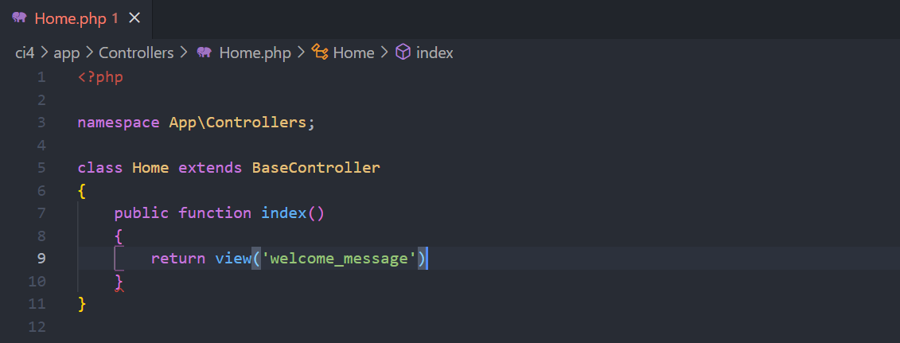
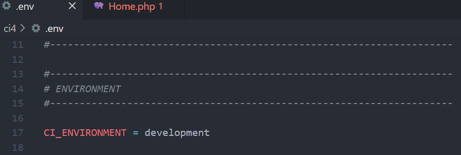
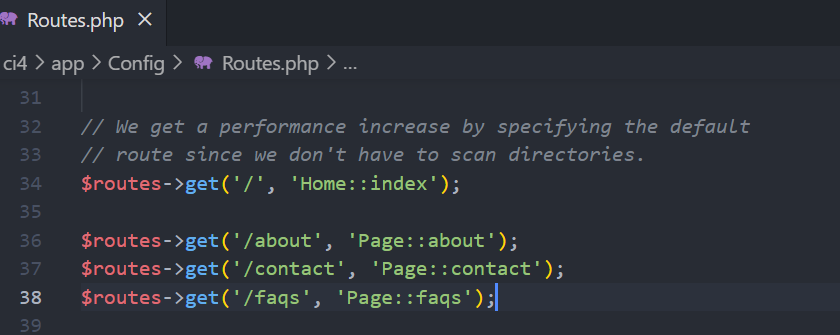
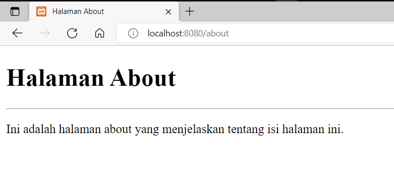
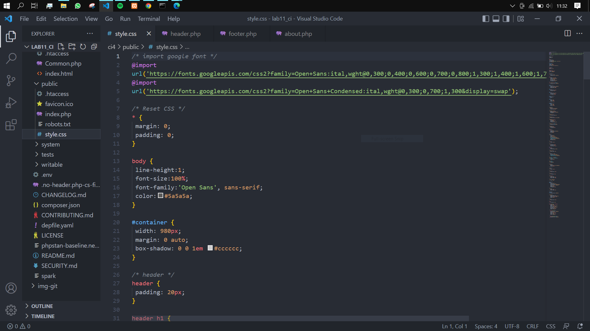
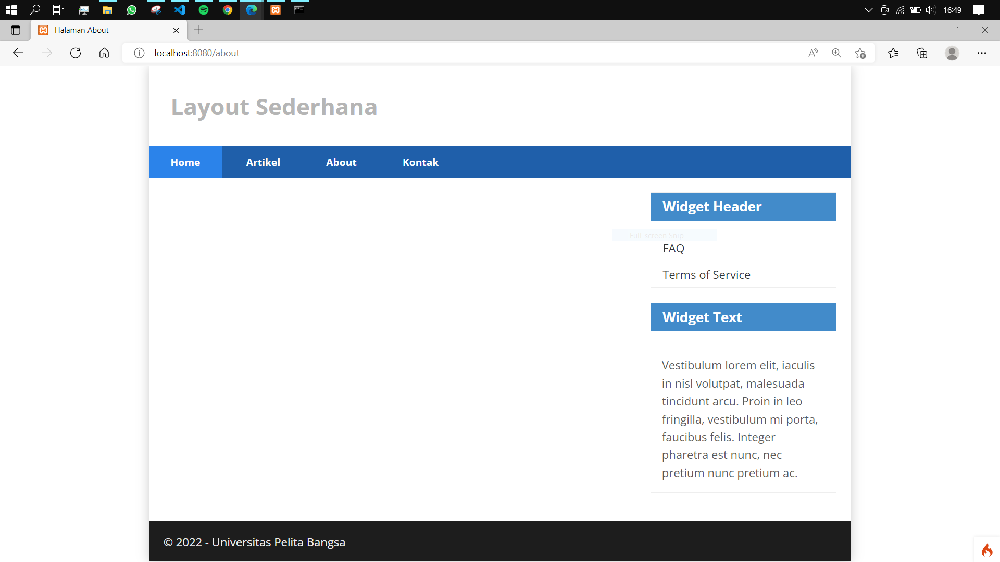
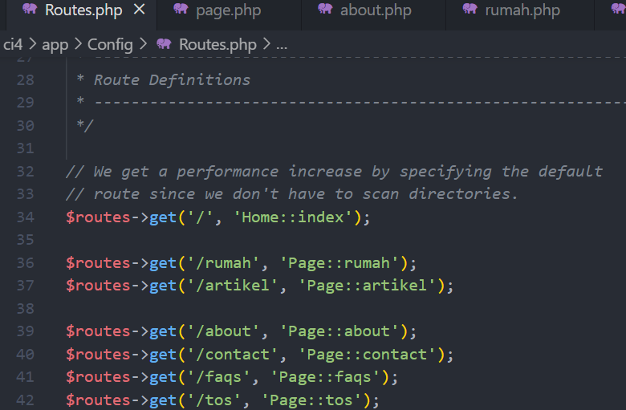
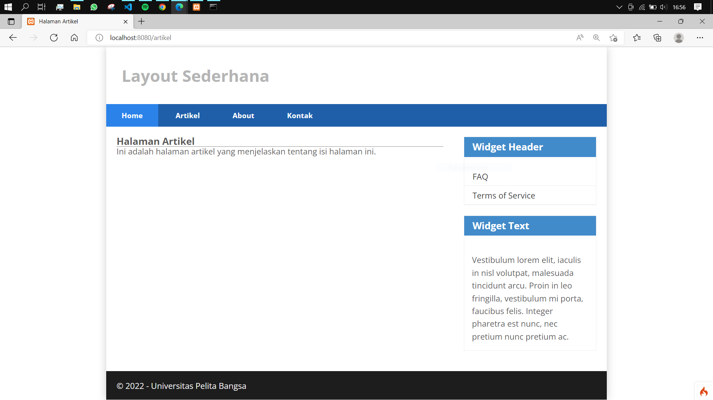
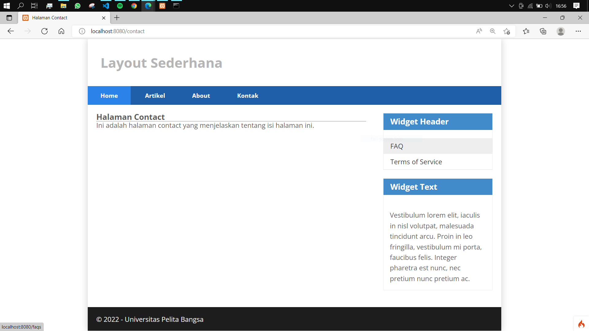

# LAB11 PHP Framework (Codeigniter)

<table border="2" cellpading="10">
  <tr>
    <td><b>Nama</b></td>
    <td>Ilham Nur Utomo</td>
  </tr>
  <tr>
    <td><b>NIM</b></td>
    <td>312010129</td>
  </tr>
  <tr>
    <td><b>Kelas</b></td>
    <td>TI.20.A1</td>
  </tr>
  <tr>
    <td><b>MataKuliah</b></td>
    <td>Pemrograman Web</td>
  </tr>
</table>

# <b>Praktikum</b>

## 1. Konfigurasi Webserver
- Mengaktifkan ekstensi melalui Xampp, bagian ``Apache > Config > PHP(php.ini)``, Hilangkan `;`.<br>


## 2. Installasi Codeigniter 
- Unduh, ekstrak, ubah nama menjadi `ci4`, pindahkan ke direktori ``htdocs/lab11_ci``, Buka browser dengan alamat ``http://localhost/lab11_ci/ci4/public``.<br>


## 3. Memanggil CLI
- Melalui ``Xampp > Shell``, kemudian pindah ke direktori ci4. Ketik ``php spark`` untuk melihat info.<br>


## 4. Debugging Mode
- Ketik ``php spark serve`` pada CLI, untuk menjalankan.<br>

<br>

- Menampilkan pesan error, untuk mencobanya ubah kode file ``app/Controllers/home.php``, hapus `;`nya.<br>

<br>

- Ketik ``http://localhost:8080`` pada browser. Berikut tampilan error nya.<br>

<br>

- Kemudian, ubah nama file ``env`` menjadi ``.env``. Masuk ke dalam filenya, hapus tanda `#` pada ``CI_ENVIRONMENT = ``<br>

<br>

- Refresh url sebelumnya, Berikut tampilan error nya.<br>

<br>

## 5. Struktur Direktori
- 

## 6. Membuat Route Baru
- Terletak pada ``app/Config/Routes.php``.<br>

<br>

- Tampilannya, ketika mengetik ``php spark routes`` pada CLI.<br>

<br>

- Mencoba akses ``http://localhost:8080/about``.<br>


## 7. Membuat Controller
- Buat ``page.php`` pada folder Controllers.
    ```php
    <?php
    namespace App\Controllers;
    class Page extends BaseController
    {
        public function about()
        {
            echo "Ini halaman About";
        }

        public function contact()
        {
            echo "Ini halaman Contact";
        }

        public function faqs()
        {
            echo "Ini halaman FAQ";
        }
    }
    ```
    <br>
- Refresh browser. <br>


- Tambah method baru, 
    ```php
    public function tos()
    {
        echo "ini halaman Term of Services";
    }
    ```

- Karena belum ada pada routing, sehingga mengaksesnya menggunakan ``http://localhost:8080/page/tos``.<br>

<br>

## 8. Membuat View
- Buat file, ``app/Views/about.php``
    ```php
    <!DOCTYPE html>
    <html lang="en">
        <head>
            <meta charset="UTF-8">
            <title><?= $title; ?></title>
        </head>
        <body>
            <h1><?= $title; ?></h1>
            <hr>
            <p><?= $content; ?></p>
        </body>
    </html>
    ```
    <br>

- Ubah method `about` pada Controllers page.<br>

<br>

- Refresh halaman tersebut.<br>

<br>

## 9. Layout dengan CSS
- Terletak di ``public/style.css``<br>

<br>

## 10. Template
- Pada direktori Views, Buat foler `template`, isi dengan file

- ``header.php``

<br>

- ``footer.php``

<br>

- Tampilan template.



# Tugas
- Lengkapi kode program untuk menu lainnya yang ada pada Controller Page, sehingga semua link pada navigasi header dapat menampilkan tampilan dengan layout yang sama.

### Jawaban 
- Ubah isi pada ``Routes.php`` menjadi berikut,<br>

<br>

- Pada ``Controllers/page.php``, menjadi berikut
    ```php
    <?php
    namespace App\Controllers;

    class Page extends BaseController
    {
        public function rumah()
        {
            return view('rumah', [
            'title' => 'Halaman Home',
            'content' => 'Ini adalah halaman home yang menjelaskan tentang isi
            halaman ini.'
            ]);
        }

        public function about()
        {
            return view('about', [
            'title' => 'Halaman About',
            'content' => 'Ini adalah halaman about yang menjelaskan tentang isi 
            halaman ini.'
            ]);
        }

        public function contact()
        {
            return view('contact', [
            'title' => 'Halaman Contact',
            'content' => 'Ini adalah halaman contact yang menjelaskan tentang isi 
            halaman ini.'
            ]);
        }

        public function artikel()
        {
            return view('artikel', [
            'title' => 'Halaman Artikel',
            'content' => 'Ini adalah halaman artikel yang menjelaskan tentang isi 
            halaman ini.'
            ]);
        }

        public function faqs()
        {
            return view('faqs', [
                'title' => 'Halaman FAQ',
                'content' => 'Ini adalah halaman FAQ yang menjelaskan tentang isi 
                halaman ini.'
                ]);
        }

        public function tos()
        {
            return view('tos', [
            'title' => 'Halaman TOS',
            'content' => 'Ini adalah halaman Terms of Service yang menjelaskan tentang isi 
            halaman ini.'
            ]);
        }
    }
    ```
- Pada masing-masing file di dalam Views, buat ``rumah.php``,``about.php``,``artikel.php``,``contact.php``,``faqs.php``, dan ``tos.php``. Isi dengan,
    ```php
        <?= $this->include('template/header'); ?>
        <h1><?= $title; ?></h1>
        <hr>
        <p><?= $content; ?></p>
        <?= $this->include('template/footer'); ?>
    ```

- Berikut Tampilannya,
- ``rumah.php``

<br>

- ``artikel.php``

<br>

- ``about.php``

<br>

- ``kontak.php``

<br>

- ``faqs.php``

<br>

- ``tos.php``

<br>